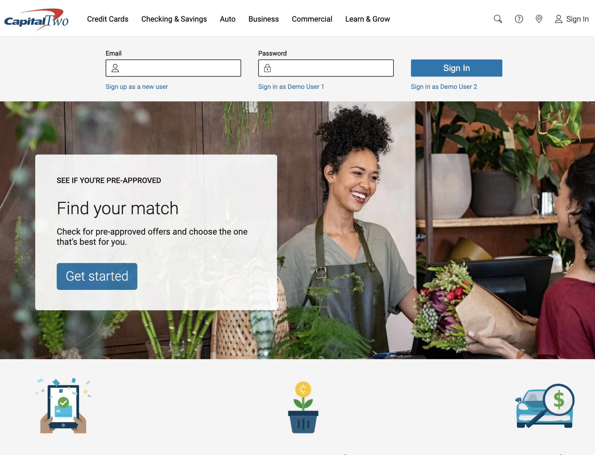

<!--!!START SILENT -->
# Capital Two Bank - A Full Stack Solo Project
<!--!!END -->
<!--!!ADD -->
<!-- # `<name of application here>` -->
<!--!!END_ADD -->
## Intro

Thank you for taking the time to check out my website. For this application, I wanted to challenge myself by dealing with a more complex database structure. So, I decided to clone my personal bank: Capital One. Banks can seem simple to use by a user, but there is so much going on in the background. Actually, keeping the UX seamless and effortless was one of my primary goals. I did take liberties in changing how the original site looked and felt in an effort to achieve that goal. And, as you can see, the UI is extremely clean and simple, which makes the website look and feel beautiful. Please enjoy!

### Check it out on Render: https://capitaltwo.onrender.com/

Allow a few minutes for the server to start up. Again, thank you so very much...I truly do appreciate your time.

### Technologies Used:
- React.js
- Redux
- Flask
- Socket.IO
- Google Maps API
- SQLite3
- SQLAlchemy
- PostgresSQL
- Node.js
- Languages: Python, Javascript, JSX, HTML, CSS

## Creating a Savings Account:

##

## Adding more money to an account:

##

## Moving funds to your other accounts:

##

## Transfering money to other users:

##

# Future Goals
- Credit Card Accounts
- Auto Loans
- AI powered help chat
- Bill Pay

##

# How To Install This Web Application Locally

Just follow the steps below to clone this repo locally.

## Getting started
1. Clone this repository to your local computer

2. Install dependencies

      ```bash
      pipenv install -r requirements.txt
      ```

3. Create a **.env** file based on the example with proper settings for your
   development environment

4. Make sure the SQLite3 database connection URL is in the **.env** file

5. This starter organizes all tables inside the `flask_schema` schema, defined
   by the `SCHEMA` environment variable.  Replace the value for
   `SCHEMA` with a unique name, **making sure you use the snake_case
   convention**.

6. Get into your pipenv, migrate your database, seed your database, and run your Flask app:

   ```bash
   pipenv shell
   ```

   ```bash
   flask db upgrade
   ```

   ```bash
   flask seed all
   ```

   ```bash
   flask run
   ```

7. To run the React App in development, checkout the [README](./react-app/README.md) inside the `react-app` directory.


