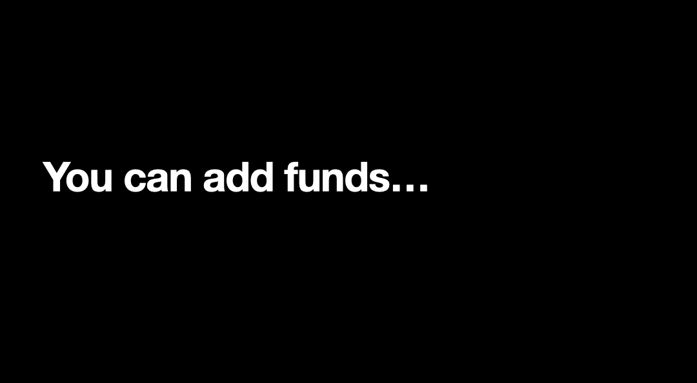

<!--!!START SILENT -->
# Capital Two Bank - A Full Stack Solo Project
<!--!!END -->
<!--!!ADD -->
<!-- # `<name of application here>` -->
<!--!!END_ADD -->
## Intro

Thank you for taking the time to checkout my project. For this website I wanted to challenge myself by dealing with a more complex database structure. So I decided to clone my personal bank: Capital One. Banks can seem simple to use by a user, but there is so much going on in the background. Actually, keeping the UX seemless, and effortless, for the user was one of my primary goals. I did take liberties in changing how the original site looked and feel in an effort to not bogged down the user. As you can see, the UI is extremely clean and simple, which in my eyes makes the website so beautiful. Please enjoy!

### If you want to check it out, just head over to Render: https://capitaltwo.onrender.com/

Please allow a few minutes for the server to start up. Again, thank you so very much; I truly do appreciate your time.

### Technologies Used:
- React.js
- Redux
- Flask
- Socket.IO
- Google Maps API
- SQLite3
- SQLAlchemy
- PostgresSQL
- Node.js
- Languages: Python, Javascript, JSX, HTML, CSS

##Creating a Savings Account:

##

##Adding more money to an account:

##

##Moving funds to your other accounts:

##

##Transfering money to other users:

